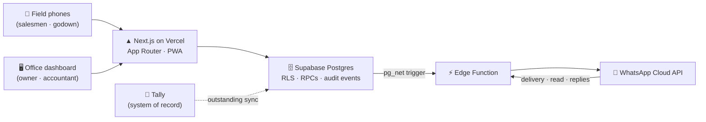

<div align="center">

# ⚡ DirectSales

### The operating system for a distribution business.

*Orders punched in the field. Money tracked to the rupee. Every receipt on WhatsApp. Tally stays the boss.*

<br/>


<br/>

**Live in production** · serving real orders, real collections, and real WhatsApp receipts for a multi-brand electronics distributor, every working day.

</div>

---

## The problem

A distribution business runs on three fragile things: a salesman's notebook, an accountant's patience, and everyone's memory. Orders get written by hand, deciphered, and re-typed into Tally. Payments are collected on trust and reconciled days later. Nobody — least of all the owner — can see today's money until tonight.

**DirectSales replaces the notebook and the guesswork, without replacing Tally.** Tally remains the statutory system of record for invoices, stock, and GST. This platform is the fast, honest capture layer in front of it — built for phones held in one hand, in shops, in sunlight.

---

## What it does

### 🛒 Field orders, in seconds
Salesmen punch orders on a phone-first Quick Order screen — recent retailers up top, brand-wise price lists, live totals. Orders flow instantly to the office dashboard with a printable pick slip for the godown. A strict lifecycle (submitted → processed → dispatched) with a short edit window and a full audit trail means an order can never quietly change shape.

### 🗂 A true multi-brand catalog
Brands, categories, price lists, and bulk imports from the distributor's own spreadsheets — with brand-aware matching rules so a Tally name maps to the right product every time. Unpriced items stay invisible to the field until the office prices them.

### 💰 Collections that can't lie
Deposits capture the paper receipt number, gross amount, discount, and payment method — the net derives live on screen as the salesman types. There is **no edit button anywhere**: a wrong deposit is voided (reason required, tight time window, admin anytime) and recorded again. The ledger, the audit trail, and the retailer's phone can never disagree.

### 🧾 Receipts on WhatsApp, instantly
The moment money is recorded, the retailer gets a WhatsApp receipt — amount, discount, collector, and their updated outstanding. Cancellations send a cancellation notice. Delivery is tracked with WhatsApp-style ticks (sent ✓ · delivered ✓✓ · read in blue), and if a shop **replies** to dispute a receipt, that reply is captured, pinned to the exact deposit, and surfaced to the owner. The owner's phone gets its own alert for every rupee in and every rupee un-happened — a fraud-resistant loop that closes in seconds, not weeks.

### 📒 The Tally bridge
Retailer outstanding balances sync from Tally and appear everywhere money is handled — on the deposit form, in receipts, frozen as a snapshot on every transaction. The app never writes Tally's numbers; it quotes them.

### 🛡 Security that lives in the database
Every role — salesman, accountant, godown, admin — sees exactly their slice, enforced by Postgres Row-Level Security, not by UI politeness. Money is stored in integer paise. Nothing is ever hard-deleted. Every mutation goes through audited server-side procedures.

### 🔔 Built like an app, delivered like a website
Installable PWA with push notifications, day-banded histories, sticky reconciliation totals, and a desktop dashboard with expandable per-transaction timelines — recorded → sent → delivered → read → replied.

---

## How it's built



| Layer | Choice | Why |
|---|---|---|
| Frontend | **Next.js 16** (App Router, TypeScript) | Server-rendered speed on cheap phones; one codebase for field + office |
| Hosting | **Vercel** | Zero-ops deploys; every merge to `main` ships |
| Data & auth | **Supabase** (Postgres, RLS, Auth) | The security model *is* the database; roles enforced at the row level |
| Messaging | **WhatsApp Cloud API** (Meta, direct) | The one app every retailer already has; no middleman BSP |
| Async | **Supabase Edge Functions + pg_net** | Receipts ride database triggers — the app can't forget to send one |
| State | **TanStack Query** | Instant-feeling lists that heal themselves in the background |

---

## Getting started

> **Prerequisites:** Node 20+, a Supabase project, a Meta WhatsApp Business number.

```bash
git clone https://github.com/mriddyagrawal/direct-sales.git
cd direct-sales
npm install
cp .env.example .env.local   # fill in the values below
npm run dev                   # http://localhost:3000
```

| Variable | What it is |
|---|---|
| `NEXT_PUBLIC_SUPABASE_URL` | Supabase project URL |
| `NEXT_PUBLIC_SUPABASE_PUBLISHABLE_KEY` | Supabase publishable key |
| `SUPABASE_SECRET_KEY` | Server-side service key (never shipped to the client) |
| `NEXT_PUBLIC_VAPID_PUBLIC_KEY` | Web-push public key |
| `WHATSAPP_TOKEN` · `WHATSAPP_PHONE_NUMBER_ID` | Meta Cloud API credentials (Edge Function secrets) |
| `WA_VERIFY_TOKEN` · `WA_TRIGGER_SECRET` · `OWNER_PHONE` | Webhook verification, trigger auth, owner-alert destination |

Database schema lives in [`supabase/migrations/`](supabase/migrations/) — apply with the Supabase CLI or dashboard. The WhatsApp pipeline deploys with `supabase functions deploy whatsapp-receipt`.

```bash
npm run lint        # ESLint
npx tsc --noEmit    # types
npx vitest run      # unit tests (money math, receipt rules)
npm run build       # production build
```

---

## Engineering culture

- **Spec-first.** Features start as written specs and recorded decisions ([`docs/`](docs/)) before they start as code.
- **Every commit reviewed.** A standing reviewer verifies each commit *by execution* — state machines, money math, RLS boundaries — with the log kept in-repo.
- **Zero-downtime by habit.** Schema changes ship expand → deploy → contract; the app has never gone down for a migration.
- **Paise, not floats.** All money is integer paise end-to-end, formatted `en-IN` at the last moment.

---

## Roadmap

- 📄 Tally invoice pulling — retailer-ledger detail on the owner's phone
- 🚚 Dispatch workflows for the godown
- 🏢 Multi-tenant SaaS — the platform, offered to other distributors
- 📊 Owner analytics — collections velocity, salesman performance, brand mix

---

<div align="center">

Built for **Ganpati Enterprises** · Korba, Chhattisgarh 🇮🇳

*Proprietary software. All rights reserved.*

</div>
